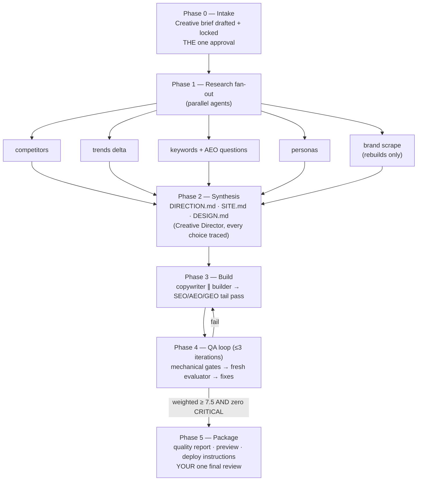

# Site Director

**An autonomous website build/rebuild orchestrator for Claude Code.
One approval up front. Zero questions in the middle. One review at the end.**

You give it a creative brief — brand, voice, personas, conversion goals. It
runs a Creative Director + agent team that researches your market, sets a
design direction, writes every word, builds every page, and QA-loops the
result against mechanical gates and a ruthless scoring rubric until it
passes. Then it hands you a preview, a quality report, and deploy
instructions. It never deploys anything itself.

Built and validated in one session: the included [example run](examples/desert-aire-dry-run/)
went from brief → 4-page Astro site scoring **8.4/10** in two QA iterations,
on ~20 research credits, with the QA loop catching a real accessibility
failure the mechanical gates couldn't see. The full story is in
[BUILD-STORY.md](BUILD-STORY.md).

---

## How it works



The main Claude session acts as **Creative Director**: it owns the brief,
spawns and arbitrates the agents, and never lets a decision ship that can't
be traced to the brief or the research. Agents communicate through artifact
files on disk (the transcript is not the memory), so runs survive
interruptions and resume from a `next-task.md` pointer.

## The agent team

| Agent | Phase | Job |
|---|---|---|
| Creative Director | all | main session — brief, arbitration, synthesis, packaging |
| sd-research-competitors | 1 | teardown of 3–5 real competitors (positioning, proof, CTA patterns, exploitable gaps) |
| sd-research-trends | 1 | baked 2026 reference pack + live niche delta |
| sd-research-keywords | 1 | keyword map + answer-engine question set per page |
| sd-research-personas | 1 | personas + objection→proof mapping |
| sd-research-brand | 1 | existing-site design-system scrape (rebuilds) |
| sd-copywriter | 3 | every word: heros, sections, CTAs, answer-first FAQs, metas, microcopy — voice-checked against the brief |
| sd-builder | 3–4 | long-lived; scaffolds, builds pages as copy decks arrive, keeps the dev server green, commits per page |
| sd-seo-engineer | 3 | JSON-LD, llms.txt, robots AI-allowlist, sitemap, OG, security headers |
| sd-qa-evaluator | 4 | **fresh spawn each iteration** — scores blind, 7 axes, "ruthlessly strict" |

## What "done" means (the QA bar)

**Layer 1 — mechanical gates** (`scripts/gate-check.mjs`, deterministic,
zero tolerance): compositor-only animation, reduced-motion fallback,
semantic-HTML ratio, JSON-LD parses, llms.txt + robots + sitemap present,
AI-crawler allowlist, image alts, bundle budget (≤150kb landing / ≤80kb
microsite JS gz), focus visibility.

**Layer 2 — evaluator rubric** (7 weighted axes): Design .20 · Brand &
voice fidelity .15 · Craft .15 · CRO readiness .15 · SEO/AEO/GEO .15 ·
Functionality .10 · A11y + performance .10.

```
PASS = weighted ≥ 7.5 AND zero CRITICAL — max 3 iterations, then open items
go to the quality report for your review.
```

Calibration is deliberately harsh: 4–5 = "functional but clearly
AI-generated", 7 = solid junior work, 10 = ship-as-real-product. The
evaluator is re-spawned fresh every iteration so it can't grade its own
homework, and it's required to do independent math (the example run's
evaluator caught a 2.98:1 contrast failure the grep gates missed).

## What's baked in

- **CRO playbook** — per-page conversion goals, hero message-match, proof
  adjacency, ≤4-field forms, sticky mobile call bars, zero fake urgency.
- **SEO + AEO + GEO** — keyword-mapped metas, JSON-LD templates
  (LocalBusiness/Service/FAQPage/BreadcrumbList), `llms.txt` +
  `llms-full.txt`, robots.txt AI-crawler allowlist, answer-first copy
  patterns backed by the Princeton GEO paper's effect sizes (quotations
  +41%, statistics +31%, citations +30%). Honest framing included — e.g.
  Google dropped FAQ rich results in 2026; the playbook says so.
- **2026 reference pack** — trends, typography (20 pairings, Google-Fonts
  mapped), OKLCH color directions with computed WCAG ratios, and a
  **93-URL-verified component registry catalog** (Aceternity, Magic UI,
  React Bits, Tailark, HyperUI, shadcn/ui) with exact install endpoints.
  Refresh quarterly: `node scripts/refresh-pack.mjs`.
- **Motion discipline** — the `motion` library (the renamed framer-motion),
  with a size ladder (CSS → `motion/mini` ~2.5kb → full `motion/react`),
  a ≤2-showpieces-per-page rule, and a hard ban on layout-property
  animation.
- **Two stack recipes** — Next.js 15 (default) and Astro (content/local-
  service; includes a `site.ts` single-source-of-truth client-facts
  contract).
- **Local-service preset** — call-first conversion armature, LocalBusiness
  schema, license/NAP discipline, tier→page-set mapping, multi-client queue
  mode — written as a worked example so you can copy it into a preset for
  your own vertical.

## Install

```bash
git clone https://github.com/BlakeB-Media1/site-director.git ~/.claude/skills/site-director
```

That's it — Claude Code picks up the skill from the folder. Full
prerequisites, Windows notes, and permission-pre-flight tips:
[INSTALL.md](INSTALL.md).

## Use

In Claude Code, in the project directory where the site should be built:

```
Run the site director for <client>. <paste or attach your brief — see
references/creative-brief.md for the template>
```

- **Complete brief + "go"** → the invocation is the approval; the run goes
  end-to-end with zero questions.
- **Thin brief** → you get exactly ONE question batch (brief confirmation,
  stack, top-3 style directions, AI-image consent), then it runs.
- **Multiple clients** → list them; queue mode collects all briefs up
  front and processes serially, one review package per site.

What you get back: a working site on a local preview server, `SITE.md` +
`DESIGN.md` + `DIRECTION.md` explaining every choice, per-page copy decks,
the QA feedback trail, and `quality-report.md` with scores, open items, and
deploy instructions for your platform. **It will not deploy** — that's
yours, after the review.

## Requirements

| Requirement | Needed for | Without it |
|---|---|---|
| Claude Code + Node ≥ 18 | everything | hard requirement |
| [Firecrawl CLI](https://www.firecrawl.dev/) (authed) | live competitor/trend research (~25–40 credits per run on the default budget) | `offline` research budget: baked pack + free web search |
| Playwright | live-browser QA | evaluator degrades to fetch/DOM mode (functionality score capped) |
| Companion skills (design-intelligence, brand-voice, SEO, …) | deeper phase passes | fully optional — every phase has a self-contained fallback in this repo |

## Repo map

```
SKILL.md                    the orchestrator protocol (what Claude reads)
references/                 phase playbooks: brief, agents, stacks, CRO,
                            SEO/AEO/GEO, motion/registries, QA rubric,
                            research protocol, local-service preset
reference-pack/             baked 2026 research: trends, typography, color,
                            AEO/GEO evidence, registry catalog (+ manifest)
scripts/                    gate-check.mjs · contrast-check.mjs · refresh-pack.mjs
examples/desert-aire-dry-run/   a complete real run: brief → research →
                            direction → copy decks → QA feedback → report
BUILD-STORY.md              how this skill was built and validated
```

## FAQ

**Does it really not ask anything mid-run?**
That's the contract. Ambiguities found mid-run become logged open items in
the quality report, not questions. The brief is immutable once locked.

**What if the QA loop can't reach 7.5?**
Three iterations max, then it ships what it has with the remaining items at
the top of the quality report. Your review decides — the skill doesn't burn
tokens chasing decimals.

**Is the Desert Aire example a real client?**
No — fictional business, fictional NAP/license, clearly labeled. But the
run was real: real competitor scrapes, real registry pulls, real builds,
real QA failures and fixes. That's the point of shipping it.

**Why registries + Motion instead of a site-builder integration?**
Deterministic, free, MIT-licensed code you own, reproducible offline. The
catalog ships verified endpoints; the failure ladder hand-writes with
Motion primitives when a pull breaks. No API keys in the build path.

**Windows?**
First-class — built and validated on Windows 11 (Git Bash + PowerShell
notes throughout, including the firecrawl `.cmd` shim gotcha).

## License

MIT — see [LICENSE](LICENSE).
